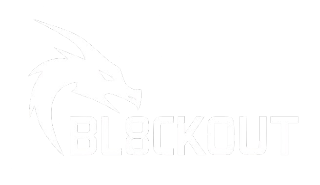

**Author:** [8nt0n](https://github.com/8nt0n)  
**Status:** Educational Prototype | Proof of Concept  

## 🚨 Legal Notice

This project is strictly for **educational**, **research**, and **demonstration** purposes.
This software is provided for educational purposes only and must not be used in violation of any applicable laws or regulations.

> ⚖️ **Disclaimer:**  
> The developer does **not condone** nor encourage any use of this code or hardware to interfere with wireless communications, disrupt networks, or violate any local, national, or international laws.  
>
> In particular, in the **European Union** and the **USA**, unauthorized transmission on RF bands is strictly illegal and subject to criminal and civil penalties. Always check with your country's RF regulations before powering any RF-emitting devices.

---

## 🧭 Ethics & Responsibility
This project aligns with the principles of ethical hacking, responsible disclosure, and STEM education. It should only be used in settings where:

You have explicit permission to operate and test the hardware

No other devices, networks, or people are affected

You are complying with all applicable laws and RF regulations

If you’re unsure whether your use is legal and ethical: **don’t use it**.

---

## 🚫 No Web Flasher / Installer
This project **does not include any sort of web-based installer or automatic flasher, and it never will.**
All firmware must be compiled and uploaded manually by the user.

**This is a deliberate decision to:**

- Reinforce that this project is **strictly for educational and research purposes**

- Ensure users fully understand and take responsibility for every part of the setup

- Avoid misuse or distribution among users who are not technically informed or legally authorized

---

## 🔧 What is Bl8ck0ut?

**Bl8ck0ut** is a dual-ESP32 hardware project combining:

- A **command-line style web interface** hosted on one ESP32 to control a relay timer.
- A second ESP32 acting as a **radio-frequency signal transmitter**, utilizing two NRF24L01+ modules on separate SPI buses (HSPI and VSPI), capable of sweeping or randomizing across channels.

The relay on the first ESP32 controls the power supply to the second ESP32, allowing timed activation through a web-based interface.

This is an **educational and experimental system** demonstrating:

- Embedded web server design using the ESP32 WiFi stack.
- Hardware-level control using relays and GPIO.
- Advanced use of multiple SPI buses and radio modules (nRF24L01+).
- Signal generation principles for RF experimentation.

> ⚠️ **This project does not transmit any meaningful data** and does not interact with or decode any external systems. Its RF output is intentionally noisy and randomized to explore channel behavior and SPI interfacing techniques.

---

## 👨‍💻 Why I Built This

I created **bl8ck0ut** to explore:

- Dual-SPI interfacing on the ESP32
- Web-based user interfaces for low-level hardware
- Safe and isolated RF experimentation
- Combining software and electronics into one seamless UX

If you’re interested in electronics, signal processing, or embedded networking, I’d love to connect!

---

# Assembly

## 📦 Hardware Requirements

- 2x ESP32 Dev Boards (Recommended: CH340 ESP32-Wroom-32S)
- 2x nRF24L01+ Modules
- 1x Relay Module
- 1x 0.96 inch OLED Display (SSD1306, I²C)
- Breadboard / Prototype board (Not necessary but strongly Recommended)
- Jumper Wires

---

## Step 1: wiring everythin up

Go to /wiring and wire everything up, following the instructions in the dedicated readme file.

## Step 2: printing the case

Go to /case and 3D print the necessary parts, following the instructions in the dedicated readme file. If you dont own a 3D printer there are some great online services like: 

- [all3dp.com](https://all3dp.com) 
- [sculpteo.com](https://sculpteo.com) 
- [hubs.com](https://hubs.com)

  After that, place the electronics in the case accordingly, glue it together and power it on 

## Step 3: 🌐 Web Terminal
1. After Powering it on you should see a new acces point called "Bl8ck0ut" with the default password beeing "12345678"
2. connect to the acces point and open a webbrowser to visit the ip 192.168.4.1
3. Then you should be greeted by the web interface for Bl8ck0ut

The primary interface is an in-browser terminal hosted via WiFi AP mode (`SSID: Bl8ck0ut`). Users can issue simple CLI-style commands such as:

- blackout start -t 60
- blackout stop
- blackout status

This controls the power relay for the second ESP32 via a countdown timer.

---

## 📜 License

This project is licensed under the [MIT License](LICENSE), with the condition that **it must not be used for harmful, malicious, or unlawful purposes**.

---

## 🗨️ Contact

Reach out via GitHub: [github.com/8nt0n](https://github.com/8nt0n)

---

> 🕊️ **Use responsibly. Hack ethically. Build boldly.**
