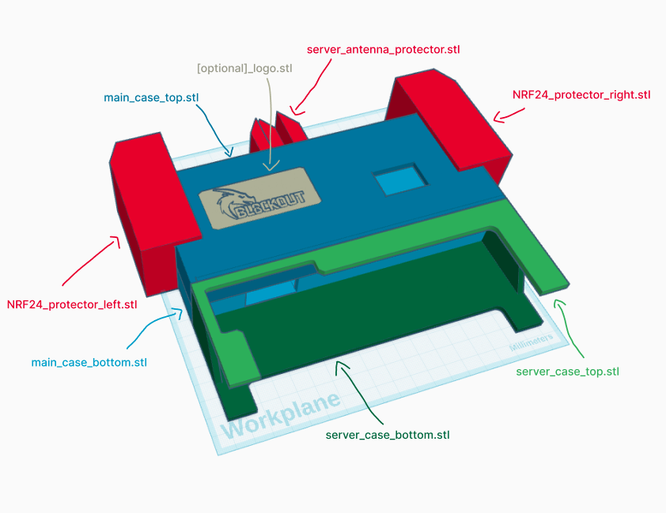
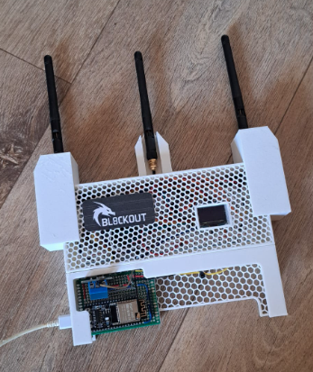

# Case Design Files for Bl8ck0ut
This directory contains the 3D printable STL files for the custom case designed for the bl8ck0ut project.

## Usage Notice
These files are provided for educational and personal use only.

Please do not use these designs for any commercial purposes or to build devices intended for illegal activities.

## Legal and Safety Reminder
Always ensure you comply with all applicable laws and regulations when assembling or operating the bl8ck0ut hardware.

The case is designed to house experimental RF equipment. Make sure your 3D printed case fits your components safely and that you do not cause harm or interference.

If unsure about legal permissions, do not use the device.

## Printing Notes
Recommended printing material: PLA

Layer height and print settings may affect fit and finish.

Post-processing may be required for best results.

"main_case_top.stl" and "server_case_bottom.stl" can be printed without top / bottom solid layers if you want to 

## Assembly
After printing each part assemble them like this:

**Important** make sure to install the electronics in the case before gluing it together

## Result
The finished device should look like that:

**Caption** Photo of the bl8ck0ut prototype hardware — shown here as an educational and experimental setup. This device is strictly for research and learning purposes only and should never be used to interfere with any wireless networks or devices without explicit legal permission.
